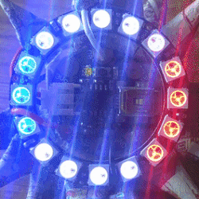
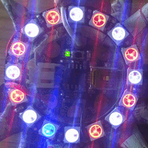

# 3-Color patterns for Gemma + NeoPixel rings

Have you done the #Digibling workshop from #Makertjej? Here are some more light patterns I made up, jumping off from the workshop 1 and 1.2 code.

Link to the first Digibling workshop: http://www.makertjej.se/digibling/

Link to the Digibling 1.2 workshop: http://www.makertjej.se/digibling-1-2-programmering/

### Programming notes
- Different size NeoPixel ring? The code default is 16-pixels (fits around a GEMMA), but this is programmed as a variable.
- The color codes used are from Material Design (500 level).

### Pattern preview
Pattern 0 - 1:

Pattern 2 - 3:

